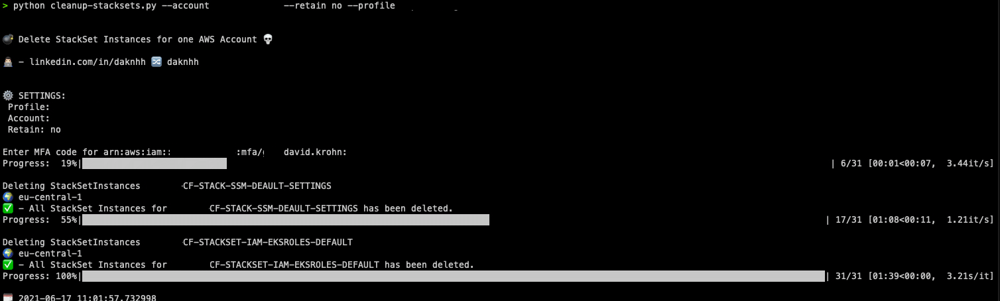

## General info
This Tool is to cleanup all StackSet Instances for one AWS Account.

## Tool info:
|Version |Author  | 
--- | --- |
|1.0 | David Krohn   [Linkedin](https://www.linkedin.com/in/daknhh/) - [Blog](https://globaldatanet.com/blog/author/david-krohn)|

## Usage
- `python cleanup-stacksets.py --account ACCOUNTID --retain yes/no --profile PROFILE`

### INFO 

- ACCOUNTID
    Define target accountid
- RETAIN
    Choose if you want to retain the stack or not (yes / no)
- PROFILE
    Define AWS Profile - should be the AWS Account where the StackSets are managed